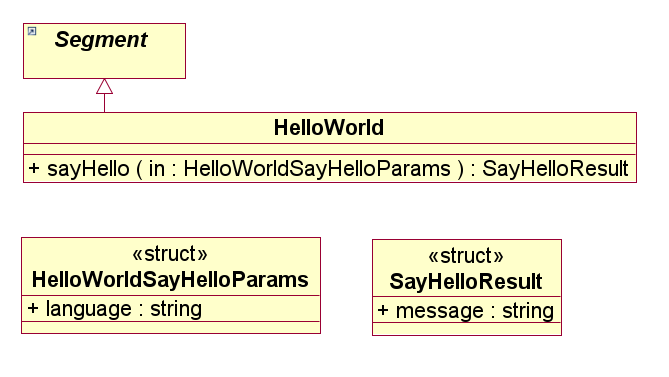

# Introduction to openMDX #

_openMDX_ is a model-driven application framework which helps you in 
writing service-oriented, _MDA_-based applications. Standards such as 
_JDO_, _MDA_, _REST_ and _JCA_ build the corner stones of 
_openMDX_. _openMDX_ implements, combines and integrates these 
standards resulting in a fully working, lightweight application framework.

# Overview #
At the heart of _openMDX_ is the JDO-compliant _openMDX_ 
persistence manager. But other than most _JDO_ persistence 
managers, the _openMDX_ persistence manager does not store objects on 
the database. Instead, it acts as a proxy which is capable of 
delegating to one or more (local or remote) persistence managers. 
The most important features of the _openMDX_ persistence manager are:

* __Pluggable__: Plug-Ins implementing business-logic can be 
  registered with the persistence manager. If an application invokes
  a method on a persistence capable object, the _openMDX_ persistence 
  manager intercepts this invocation and dispatches the call to the 
  appropriate plug-in.
* __Distributable__: The _openMDX_ persistence manager can either 
  delegate to local or remote persistence managers. The protocol 
  used for the local communication is _REST/JCA_ and for the remote 
  communication _REST/HTTP_. _openMDX_ provides the necessary 
  _REST_ infrastructure. The persistence manager is configured 
  with a _jdoconfig.xml_ configuration file. Whether local or 
  remote transports are used is completely transparent to the 
  application.

The _openMDX_ persistence manager allows to write simple, distributable 
and portable applications. For example a hello world client which 
invokes a _sayHello()_ service looks as follows:

~~~~~~
:::java
import org.openmdx.example.helloworld1.*;
  
javax.jdo.PersistenceManagerFactory pmf = JDOHelper.getPersistenceManagerFactory("EntityManagerFactory");
javax.jdo.PersistenceManager pm = pmf.getPersistenceManager("guest", "guest");
HelloWorld helloWorld = (HelloWorld)pm.getObjectById(HELLOWORLD_XRI);
HelloWorldPackage helloWorldPkg = 
  (HelloWorldPackage)helloWorld.refOutermostPackage().refPackage(Helloworld1Package.class.getName());
pm.currentTransaction().begin();
org.openmdx.example.helloworld1.SayHelloResult hResult = helloWorld.sayHello(
  helloWorldPkg.createHelloWorldSayHelloParams("en")
);
pm.currentTransaction().commit();
System.out.println("Client: sayHello[en]=" + hResult.getMessage());
~~~~~~

__NOTE__:

* The _openMDX_ persistence manager factory is looked up with the 
  configuration-id _EntityManagerFactory_ which is configured in 
  the _jdoconfig.xml_. 
* The application client does not know whether the _sayHello()_ service 
  is deployed locally or remote.
* The transaction (or unit of work) handling is either optimistic or
  non-optimistic according to the configuration of the persistence 
  manager.
* Java interfaces such as _HelloWorldPackage_, _HelloWorld_, 
  _SayHelloParams_, _SayHelloResult_ are generated from the 
  _HelloWorld_ _UML_ model.
* Each _openMDX_-based application is automatically a service, or more 
  precisely a _RESTful_ service. In case the _HelloWorld_ service is 
  deployed as remote service, the operation _sayHello()_ can be invoked
  with a _POST_ request and the resource with the XRI _HELLOWORLD_XRI_ 
  can be retrieved with a _GET_ request by any _REST_ client.

In addition, _openMDX_ provides tools which are used at development time 
such as the model mappers. They are responsible to map a _MOF_-compliant
class diagram to corresponding Java interfaces, _XML_ schemas, _JPA_ 
classes and _ORM_ mapping files.

# Key concepts #

## JDO ##
The _Java Data Objects (JDO)_ API is a standard interface-based Java 
model abstraction of persistence, developed under the auspices of the
Java Community Process. The original JDO 1.0 is Java Specification 
Request 12 (JSR 12), and the current JDO 2.0 is Java Specification 
Request 243 (JSR 243). The benefits of using _JDO_ for application 
programming are:

* __Ease of use__: Application programmers can focus on their domain 
  object model and leave the details of persistence (field-by-field 
  storage of objects) to the JDO implementation. 
* __Portability__: Applications written with the _JDO_ API can be run 
  on multiple implementations without recompiling or changing source 
  code. Metadata, which describes persistence behavior external to 
  the Java source code including most commonly used features of O/R 
  mapping, is highly portable. 
* __Database independence__: Applications written with the _JDO_ API 
  are independent of the underlying database. _JDO_ implementations 
  support many different kinds of transactional data stores, including 
  relational and object databases, _XML_, flat files, and others. 
* __High performance__: Application programmers delegate the details 
  of persistence to the _JDO_ implementation, which can optimize data
  access patterns for optimal performance. 

However, the _JDO_ and _JPA_ (Java Persistence Architecture) 
leaves an important question unanswered: where comes the business 
logic? One can put all or part of the business logic into the persistence 
capable (or entity) classes (or into a library which is invoked by the 
persistence capable class). Or one can put an application-layer on top
of the persistence layer. However, all these approaches have drawbacks:

* There is no clean separation between business and persistence 
  logic
* The business logic is located in the persistence tier instead of in 
  the application tier
* Introducing an application layer also introduces a different style
  of architecture and programming. Code which delegates to the
  application layer looks different than code which delegates to
  the persistence layer. This way code is layer-specific and hence
  not as portable and reusable as should be.

The _openMDX_ persistence manager addresses these issues as follows:

* The _openMDX_ persistence manager is a JDO-compliant implementation 
  which acts as a proxy to one or more (local or remote) persistence 
  managers. By default all invocations are delegated to one of the 
  configured proxies (routing is configurable).
* The business logic is isolated into separate classes, called aspect
  oriented plug-ins (AOP). Persistence capable classes do not contain
  any business logic. Their only responsibility is to make an object 
  persistent. As a consequence, the persistence capable classes can 
  be generated, so no programming is required at this level. AOPs 
  are registered with the _openMDX_ persistence manager. If an 
  application invokes a method of a persistence capable, the _openMDX_ 
  persistence manager intercepts the invocation and dispatches the 
  call to the registered AOPs. In case no AOP intercepts the 
  invocation, the call is forwarded to one of the configured delegation
  persistence mangers.
* The _openMDX_ persistence manager is stackable. This allows to 
  split the business logic into layers, i.e. different aspects 
  (business logic, generic functions such as auditing or access 
  control) of the application logic can be completely separated.

## REST and JCA ##
The openMDX persistence manager acts as a proxy persistence manager 
and allows to delegate to one or more (local or remote) persistence 
managers. The protocol used for communication between persistence 
managers is _REST_:

* Object retrievals are mapped to a _GET <object xri>_
* Queries are mapped to a _GET <reference xri, query>_
* Object modifications are mapped to _PUT <object>_
* Object creations are mapped to _POST <object>_
* Method invocations are mapped to _POST <object xri, method, parameters>_
* Object removals are mapped to _DELETE <object xri>_

_REST/HTTP_ is used for remote (inter-process) and _REST/JCA_ for 
local communication between persistence mangers. What is _REST/JCA_? 
_REST_ was initially described in the context of _HTTP_, but is 
not limited to that protocol. _RESTful_ architectures can be based 
on other application layer protocols if they already provide a rich and 
uniform vocabulary for applications based on the transfer of meaningful 
representational state.

The _Java EE Connector Architecture (JCA)_ ([http://jcp.org/aboutJava/communityprocess/final/jsr322/index.html JCA]) 
provides a suitable application layer protocol. The _REST_ 
methods _GET_, _PUT_, _POST_ and _DELETE_ are mapped 
to corresponding _REST_ interaction specifications. The remote 
persistence manager is treated as a _JCA_ resource. Using 
_REST/JCA_ an object retrieval looks as follows:

~~~~~~
:::java
javax.resource.cci.Connection conn = connectionFactory.getConnection(
  new RestConnectionSpec(user, password)
);
javax.resource.cci.RecordFactory rf = connectionFactory.getRecordFactory();
javax.resource.cci.Interaction interaction = conn.createInteraction();
InteractionSpec ispec = InteractionSpecs.getRestInteractionSpecs(true).GET;
javax.resource.cci.IndexedRecord input = factory.createIndexedRecord(Multiplicities.LIST);
input.add(object_xri);
javax.resource.cci.Record output = interaction.execute(ispec, input);
~~~~~~

Output contains the retrieved object in a _JCA_ record.

Using _REST_ as unified communication protocol has the following 
advantages:

* __Independent deployment of components__: an application using the 
  _openMDX_ persistence manager can either be deployed in-process or 
  fully distributed. 
* __Integration__: A persistence manager configured for _REST/HTTP_ 
  can be accessed by any 3rd party _REST_ client. This allows easy 
  integration of _openMDX_-based applications with non-_openMDX_ 
  applications and even with non-Java applications.
* __Lightweight__: The implementation of _REST/HTTP_ and 
  _REST/JCA_ is lightweight. All that is required on client-side 
  is a _HttpUrlConnection_ and on server-side a WebApp container
  such as _Tomcat_.
* __Scalability__: An application using the _openMDX_ persistence 
  manager is scalable out-of-the box. A persistence manager deployed
  under _Tomcat_ can handle multiple sessions and concurrent requests
  (such as all _HTTP_ servlets can).  

## MDA ##
Based on _OMGs_ established standards such as

* Unified Modeling Language (UML)
* MetaObject Facility (MOF )
* XML Metadata Interchange (XMI)
* Common Warehouse Metamodel (CWM)

the _OMG's Model Driven Architecture_ ([http://www.omg.org/mda MDA]) 
standards separate business and application logic from the underlying
platform technology. Platform-independent models (_PIMs_) of an 
application or integrated systems's business functionality and 
behaviour, built using _UML_ and the other associated _OMG_ modeling 
standards, can be realized through the _MDA_ on virtually any platform,
open or proprietary, including WebServices, _.NET_, _CORBA_, 
_J2EE_, and others. These platform-independent models document 
the business functionality and behaviour of an application separate 
from the technology-specific code that implements it, insulating the 
core of the application from technology. 

The domain object model of an _openMDX_-based application 
is specified by a platform-independent model (_PIM_). The model does not 
contain any platform-specific (_J2EE_, _WSDL_, _CORBA_, 
_RPC_, etc.) information. Using the _MDA/PIM_-approach 
has the following advantages:

* __Automation__: the _PIM_ can be mapped by generators to any 
  platform-specific artifact by applying the mappings specified by 
  the _MDA_ standards. E.g. the _PIM_ can be mapped to a 
  Java API by applying the _JMI_ mapping (specified by the [http://java.sun.com/products/jmi/index.jsp Java metadata interface (JMI)] 
  standard).
* __Single-source__: the domain model has to be specified exactly once
  even if the application must support several platforms, e.g. expose
  the application logic as Java library, _REST_ or _RPC_ service.
* __Model-driven algorithms__: According to the _MDA_ standards, _PIMs_ 
  are stored in a _MOF (Meta Object Facility)_ repository which is 
  accessible to the application at runtime. This allows an 
  application to inspect the model and perform generic, model-driven
  algorithms on application data.

The development process is rather straight-forward: first the business objects (BOs) are 
specified by platform-independent, _MOF_-compliant class diagrams. These are then mapped by 
_openMDX_-generators to Java interfaces by applying the _MOF_ to Java mapping 
(specified by the [http://java.sun.com/products/jmi/index.jsp Java metadata interface (JMI)] 
standard). These interfaces define the API of the the application's domain object model.

The corresponding _JMI_ interface is shown below:

~~~~~~
:::java
package org.openmdx.example.helloworld1.jmi1;

public interface HelloWorld
  extends org.openmdx.example.helloworld1.cci2.HelloWorld,
    org.openmdx.base.jmi1.Segment{

  public org.openmdx.example.helloworld1.jmi1.SayHelloResult sayHello(
      org.openmdx.example.helloworld1.jmi1.HelloWorldSayHelloParams in
  );

}
~~~~~~

A sample hello world client:

~~~~~~
:::java
import org.openmdx.example.helloworld1.*;
  
javax.jdo.PersistenceManagerFactory pmf = JDOHelper.getPersistenceManagerFactory("EntityManagerFactory");
javax.jdo.PersistenceManager pm = pmf.getPersistenceManager("guest", "guest");
HelloWorld helloWorld = (HelloWorld)pm.getObjectById(HELLOWORLD_XRI);
HelloWorldPackage helloWorldPkg = (HelloWorldPackage)helloWorld.refOutermostPackage().refPackage(Helloworld1Package.class.getName());
pm.currentTransaction().begin();
org.openmdx.example.helloworld1.SayHelloResult hResult = helloWorld.sayHello(
  helloWorldPkg.createHelloWorldSayHelloParams("en")
);
pm.currentTransaction().commit();
System.out.println("Client: sayHello[en]=" + hResult.getMessage());
~~~~~~

The hello world implementation:

~~~~~~
:::java
package org.openmdx.example.helloworld1.aop2;

import javax.jmi.reflect.RefException;

import org.openmdx.base.aop2.AbstractObject;
import org.openmdx.example.helloworld1.jmi1.HelloWorldSayHelloParams;
import org.openmdx.example.helloworld1.jmi1.Helloworld1Package;
import org.openmdx.example.helloworld1.jmi1.SayHelloResult;

public class HelloWorldImpl
    <S extends org.openmdx.example.helloworld1.jmi1.HelloWorld,N extends org.openmdx.example.helloworld1.cci2.HelloWorld,C extends Void>
    extends AbstractObject<S,N,C> {

    public HelloWorldImpl(
        S same,
        N next
    ) {
    	super(same, next);
        System.out.println("Plugin: instantiating HelloWorldImpl");
    }
              
    public SayHelloResult sayHello(
	    HelloWorldSayHelloParams params
    ) throws RefException {
        System.out.println("Plugin: invoking sayHello(language=" + params.getLanguage() + ")");
        String language = params.getLanguage();
        String message = null;
        if("de".equals(language)) {
            message = "hallo welt";
        }
        else if("fr".equals(language)) {
            message = "bonjour monde";
        }
        else {
            message = "hello world";
        }       
        return ((Helloworld1Package)this.sameObject().refOutermostPackage().refPackage(
            Helloworld1Package.class.getName())
        ).createSayHelloResult(message);
    }
    
}
~~~~~~

## The openMDX persistence manager ##
In detail, the _openMDX_ persistence manager works as follows:

* At the top level there are one or more _entity managers_. 
  Their responsibility is to dispatch API method invocations issued
  by the client application and dispatch them to the configured AOPs. 
  The last entity manager in the stack delegates to the 
  object view manager which manages service data objects (SDOs). 
  SDOs implement a generic interface which allows to manage the
  object's state in a generic way, e.g. objSetValue(feature, value) 
  or _objGetValue(feature)_. For more information about SDOs see 
  [http://www.ibm.com/developerworks/java/library/j-sdo/ Introduction to Service Data Objects].
  (__NOTE:__ openMDX SDOs implement the interface _DataObject_1_0_ 
  which is a much simpler and more JDO- and JPA-aligned than 
  originally specified by IBM). Typed JMI method invocations are 
  mapped to the SDO interface. E.g. if the client application invokes
  the method Person.setName(String name), the JMI persistence manager 
  first checks if any AOP implements the method. If an implementation 
  is found, the call is dispatched to this AOP. If none is found, the 
  call is forwarded to the corresponding SDO and mapped to the method 
  _objSetValue("name", value)_.
* The _object view manager_ manages SDOs. It does it more or less the 
  same way as the _JMI_ entity manager, however it allows to implement 
  low-level, generic plug-ins. It also allows to register AOPs and 
  dispatches method invocations. In order to be able to distinguish
  plug-ins at the different levels, plug-ins at JMI level are called
  AOP2, whereas plug-ins at object view level are called AOP1. 
  The object view manager delegates to the next entity manager in 
  the stack which is the data object manager.
* The _data object manager_ manages transactions (also called 
  unit of work), the state and the life-cycle of SDOs. The data 
  object manager is either delegates to a local or remote _JCA_ 
  connection. All object operations are mapped to _REST_ interactions.

# Summary #
_openMDX_ helps you in writing platform-independent applications. The 
application's interface is specified with a platform independent model 
(_PIM_) and the business logic is implemented as POJOs (plain old Java 
objects) which are platform-, distribution- and persistence-technology
independent. The application can be deployed locally or distributed by 
using the _RESTful_, _JDO_-compliant _openMDX_ persistence 
manager. The resulting applications are lightweight and can be deployed 
on any _J2SE_ or _J2EE_ platform such as _Tomcat/OpenEJB_.
