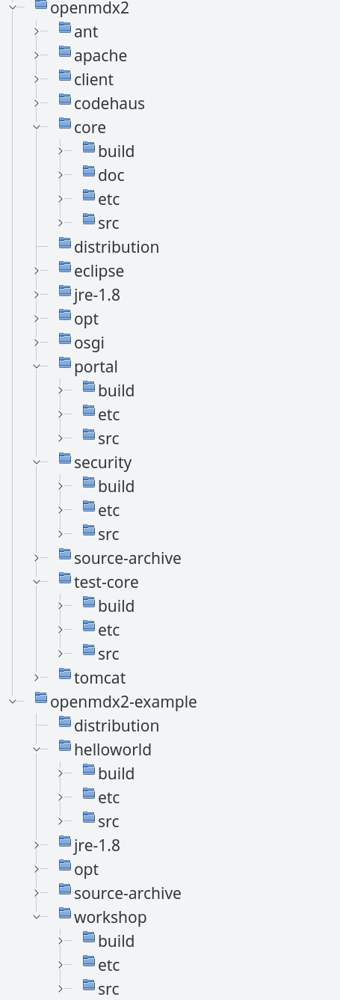
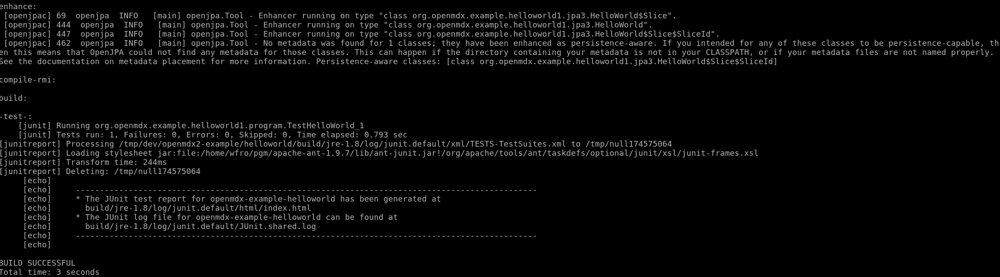
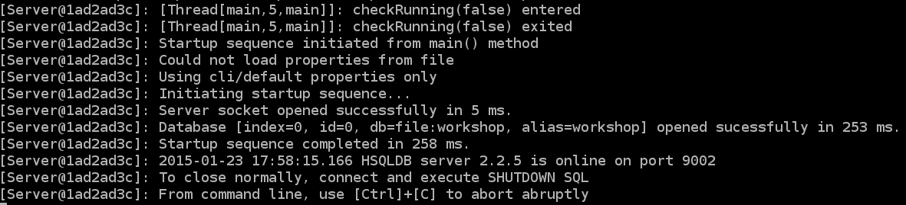
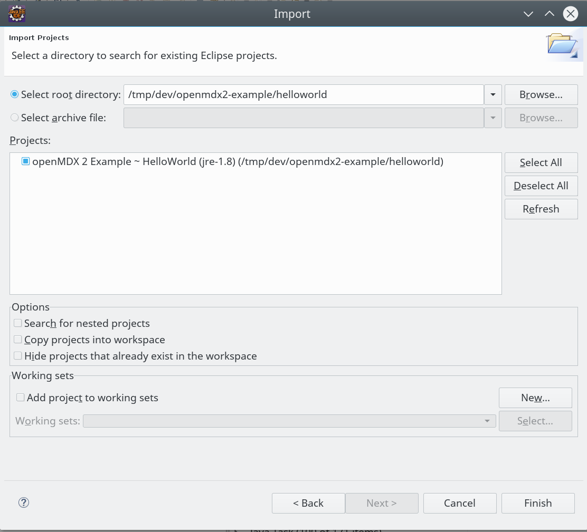
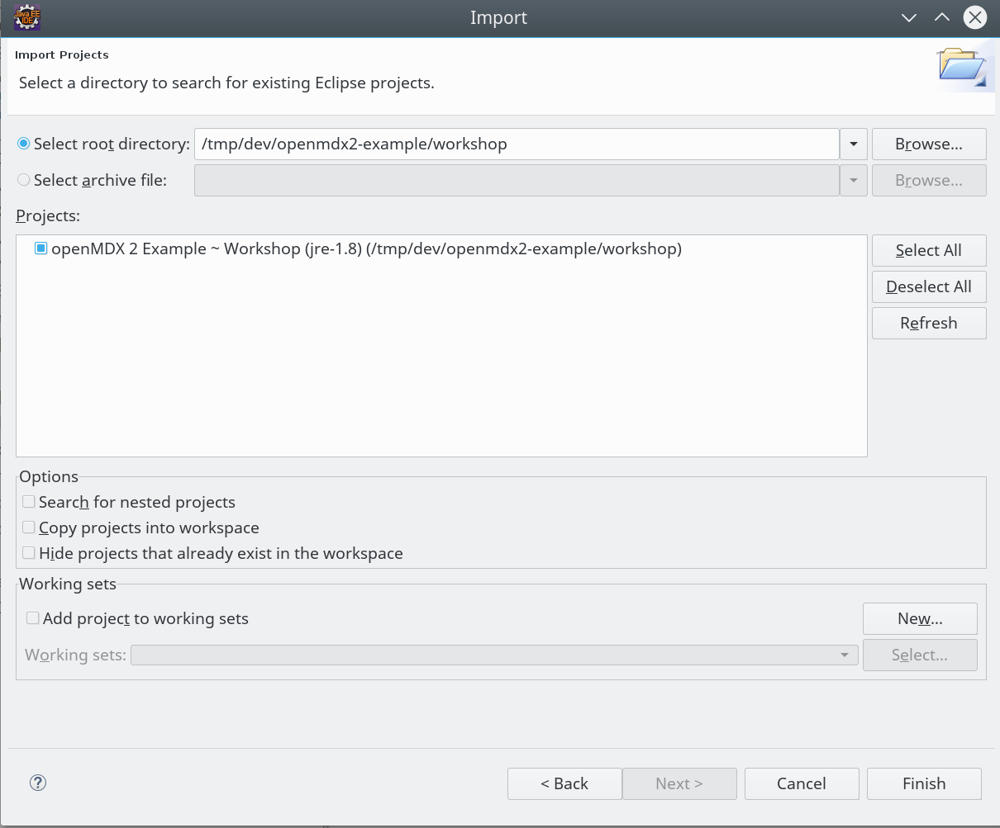
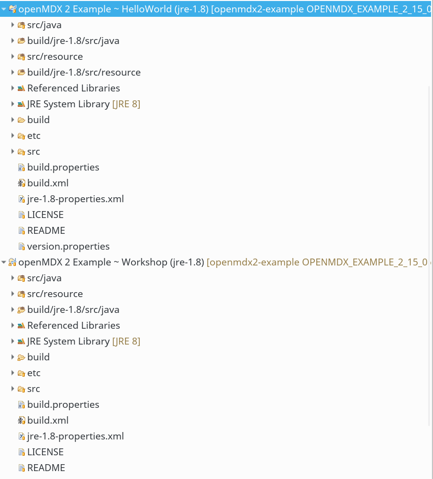
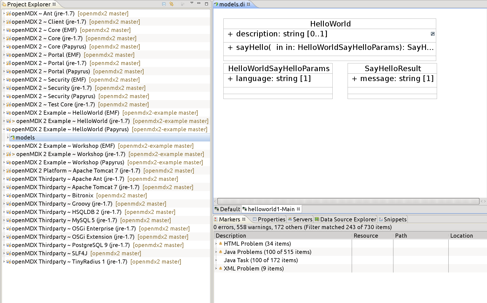
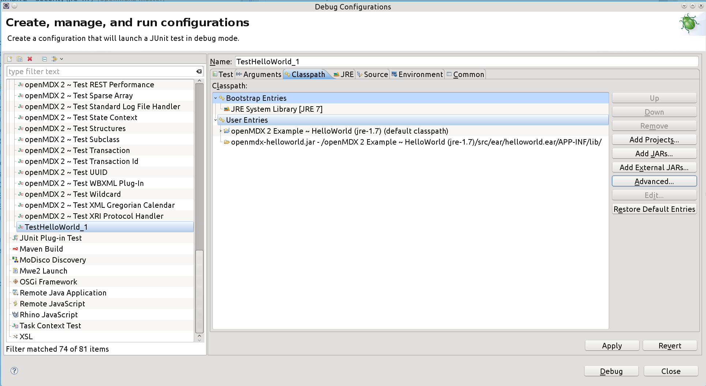

# openMDX SDK Examples #

This guide explains how to build the _openMDX Examples_.

## Prerequisites ##

This guide assumes that _openMDX SDK for Eclipse_ is prepared as described in [openMDX SDK for Eclipse Step-by-Step Guide](./StepByStepEclipse.md).

## Build for Linux ##

In a first step open a shell and cd to a directory where you have installed _openMDX SDK_.

~~~~~~
cd dev
./setenv.sh
~~~~~~

Get the _openMDX Examples_ sources from the GIT repository:

~~~~~~
git clone https://github.com/openmdx/openmdx-example.git openmdx-example
git checkout openmdx-2.13.0
~~~~~~

Now build the _openMDX/Examples_. First prepare the _opt_ directory:

~~~~~~
cd openmdx-example
cd opt
ant install-opt
cd ..
~~~~~~

And then build the example projects _HelloWorld_ and _Workshop_

~~~~~~
cd helloworld
ant all
cd ..
cd workshop
ant all
~~~~~~

## Build for Windows ##

In a first step open a shell and cd to a directory where have installed _openMDX SDK_.

~~~~~~
cd dev
setenv.cmd
~~~~~~

Get the _openMDX Examples_ sources from the GIT repository:

~~~~~~
git clone https://github.com/openmdx/openmdx-example.git openmdx-example
git checkout openmdx-2.13.0
~~~~~~

Now build the _openMDX/Examples_. First prepare the _opt_ directory:

~~~~~~
cd openmdx-example
cd opt
ant install-opt
cd ..
~~~~~~

And then build the example projects _HelloWorld_ and _Workshop_

~~~~~~
cd helloworld
ant all
cd ..
cd workshop
ant all
~~~~~~

## Verify ##
After successful installation the directory structure looks like shown below. The top-level directories are:

* _openmdx/core_
* _openmdx/security_
* _openmdx/portal_
* _openmdx/test-core_
* _openmdx-example/helloworld_: contains the helloworld project
* _openmdx-example/workshop_: contains the workshop project

## Running the JUnits ##
Now you are ready to run the JUnit tests. Let's start with the _helloworld_ project.

~~~~~~
cd ./openmdx-example/helloworld
ant deliverables
ant test
~~~~~~

After running _ant test_ your console should look like shown below.

Next we build and test the _workshop_ project:

~~~~~~
cd ./openmdx-example/workshop
ant deliverables
ant test
~~~~~~

After running ant test your console should look like shown below.

_ant test_ will report errors. The console output shows an URL pointing at the JUnit test report.

Open the report with a browser and navigate to the error log. The stack trace shows that we have a _MEDIA_ACCESS_FAILURE_ exception and the description is _Failure when getting a connection from java:comp/env/jdbc/datasource\[0\]_. The workshop example tries to establish a database connection. However, this fails because we did not start the workshop database yet.

The database connection URL is hard-coded in the JUnit test driver _TestExample\_1.java_. 

~~~~~~
:::java
public TestExample_1(
	String name
) throws NamingException{
	super(name);
	if(!NamingManager.hasInitialContextFactoryBuilder()) {
		NonManagedInitialContextFactoryBuilder.install(
			Collections.singletonMap(
				"org.openmdx.comp.env.jdbc.jdbc_openmdx_example_workshop",
				"jdbc:hsqldb:hsql:\\/\\/127.0.0.1:9002\\/WORKSHOP?user=sa&password=manager99&driver=org.hsqldb.jdbcDriver"
			)
		);
	}
}  
~~~~~~

Before we can run the test successfully we first have to start the _HSQLDB_ database engine as follows:

~~~~~
cd ./openmdx-example/workshop/etc/data/workshop
startdb.bat on Windows platforms or ./startdb.sh on Linux
~~~~~

We are now ready to run ant test for the project _workshop_ again. This time the tests should complete without errors.

You can also look at the database tables and data by launching the _HSQLDB_ database manager:

~~~~~
cd ./openmdx-example/workshop/etc/data/workshop
startdbmanager.bat on Windows platforms or ./startdbmanager.sh on Linux
~~~~~

If you want to start with an empty database you can create a new database with the following steps:

~~~~~
ant -Ddatabase.name="hsqldb-2" create-schema
~~~~~

Run the scripts _dbcreate-tables.sql_, _dbcreate-views.sql_ and _populate-preferences.sql_ located in the directory _./openmdx-example/workshop/src/sql/hsqldb-2_

## Adding projects to Eclipse ##
We now are ready to add the example projects to the _Eclipse_ workspace.

First we import the _HelloWorld_ project from _openMDX/Example_. Open the import dialog with _File > Import > Existing Projects into Workspace_. Navigate to the directory _./openmdx-example/helloworld_. Select the _helloworld_ project as indicated below:

Then we import the _Workshop_ project from _openMDX/Example_. Open the import dialog with _File > Import > Existing Projects into Workspace_. Navigate to the directory _./openmdx-example/workshop_. Select the _helloworld_ project as indicated below:

The structure of the project explorer looks as shown below. _Eclipse_ must be able to compile all projects without errors.

Finally, we add the EMF (Eclipse Modeling Framework) project files to the workspace. The projects contain the following UML class diagrams:

* _openMDX 2 Example ~ HelloWorld (EMF)_
* _openMDX 2 Example ~ Workshop (EMF)_

In order to view the class diagram of the HelloWorld projects, expand the project _openMDX 2 Example ~ HelloWorld (EMF)_ and open the class diagram _org.openmdx.example.helloworld1-Main.umlclass_.

__NOTE__: the class diagram _models-main.umlclass_ does not contain a valid diagram and will be removed in the next version of _openMDX SDK_.

The HelloWorld project only contains three classes:

* The class _HelloWorld_ defining the operation _sayHello()_
* The operation's _sayHello()_ input parameter _HelloWorldSayHelloParams_
* The operation's _sayHello()_ output parameter _HelloWorldSayHelloResult_

The openMDX application consists of a client and a service. The HelloWorld client invokes the operation _sayHello()_, the HelloWorld service implements the operation. 

We are now ready to run the _Helloworld_ JUnits. Open the folder _src/java_ in the project _openMDX/Example Helloworld_ and navigate to the package _org.openmdx.example.helloworld1.program_. Right click on _TestHelloWorld_1_ and select _Run As > JUnit Test_.

The JUnit will report errors. To fix the problem open the run dialog with _Run > Open Run Dialog_ and select _TestHelloWorld_1_ in the tab _JUnit_. Select the tab _Classpath_ and click the button _Advanced..._. Select the option _Add Folders..._:

Navigate to the folder _openmdx-helloworld.jar_ and select it:

The classpath should now look as follows:

Run the test again. It should now complete successfully.

Do the same with the JUnit _TestExample_1_ from the Workshop project located in the package _org.openmdx.test.example.workshop1_ in the project _openMDX/Example Workshop_. Do not forget to

* Add the folder _openmdx-workshop.jar_ to the classpath
* Add the project _openMDX Thirdparty HSQLDB 2_ to the classpath
* Start the workshop database as explained in the section _Running Tests_

## Congratulations ##
Congratulations! You have successfully built and run the _openMDX Examples_.
