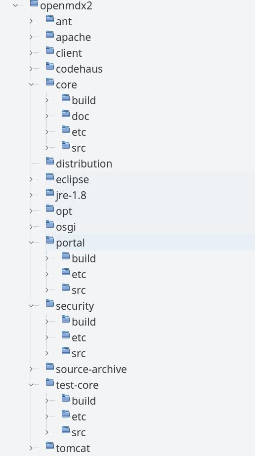

# openMDX SDK for Ant Step-by-Step #

This guide explains how to build _openMDX SDK_ from the sources.

## Prerequisites ##

Before you are able to build openMDX make sure that you have the following software installed:

* [JDK 1.6](http://java.sun.com/javase/downloads/widget/jdk6.jsp) or [OpenJDK 1.6](http://openjdk.java.net/)
* [Apache Ant 1.9.2](http://ant.apache.org/bindownload.cgi)
* [GIT](http://git-scm.com/downloads)

## Build for Linux ##

In a first step open a shell and cd to a directory where you want to download and build openMDX. Then execute the commands:

~~~~~~
mkdir dev
cd dev
vi setenv.sh
~~~~~~

Launch _vi_ and create the script _setenv.sh_. Adapt the variables to your environment. Save the file and exit vi.

~~~~~~
#!/bin/sh
export JAVA_HOME=/usr/lib/jvm/java-6-openjdk-amd64
export ANT_HOME=/opt/apache-ant-1.9.2
export JRE_16=$JAVA_HOME/jre
export PATH=$JAVA_HOME/bin:$ANT_HOME/bin:$PATH
~~~~~~

Make the _setenv.sh_ executable and run it.

~~~~~~
chmod a+x setenv.sh
./setenv.sh
~~~~~~

Get the openMDX sources from the GIT repository:

~~~~~~
git clone https://github.com/openmdx/openmdx.git openmdx
git checkout openmdx-2.13.0
~~~~~~

And then build _openMDX/Core_.

~~~~~~
cd openmdx
ant all
~~~~~~

## Build for Windows ##

In a first step open a shell and cd to a directory where you want to download and build openMDX. Then execute the commands:

~~~~~~
mkdir dev
cd dev
notepad setenv.cmd
~~~~~~

Launch _notepad_ and create the script _setenv.cmd_. Adapt the variables to your environment. Save the file and exit vi.

~~~~~~
set JAVA_HOME=C:\pgm\Java\jdk1.6.0_29
set ANT_HOME=C:\pgm\apache-ant-1.9.2
set JRE_16=%JAVA_HOME%\jre
set OPENMDX_BIN_HOME=c:\temp\dev\openmdx\core\thirdparty
set PATH=%JAVA_HOME%\bin;%ANT_HOME%\bin;%OPENMDX_BIN_HOME%\bin\windows;%PATH%
~~~~~~

Run _setenv.cmd_.

~~~~~~
setenv.cmd
~~~~~~

Get the openMDX sources from the GIT repository:

~~~~~~
git clone https://github.com/openmdx/openmdx.git openmdx
git checkout openmdx-2.12.0
~~~~~~

And then build _openMDX/Core_.

~~~~~~
cd openmdx
ant all
~~~~~~

## Verify ##
After successful installation the directory structure looks like shown below. The top-level directories are:

* _openmdx/core_
* _openmdx/security_
* _openmdx/portal_
* _openmdx/test-core_

## Congratulations ##
Congratulations! You have successfully built _openMDX SDK_ from the sources.
