# openMDX SDK for _Eclipse_ Step-by-Step Guide #

This guide explains how to setup _openMDX SDK_ for _Eclipse_.

__IMPORTANT:__ This guide assumes that the _openMDX SDK_ is prepared as described in [openMDX SDK for Ant Step-by-Step](./StepByStepAnt.md).

Make sure that you have installed _Eclipse Neon_ (download it from [here](http://www.eclipse.org/downloads/packages/release/Neon/1.RC3/)).

Also make sure that you have installed the _Papyrus Plugin for Eclipse_ in order to be able to view the UML diagrams which come with the _openMDX SDK_. See [here](http://www.eclipse.org/papyrus/updates/) for installation instructions.  

After installation launch _Eclipse_. Create a new workspace by selecting _File > Switch Workspace > Other_. Enter the directory name of the new workspace. In this guide we will use the directory _/tmp/dev/eclipse/openmdx_ as shown below:

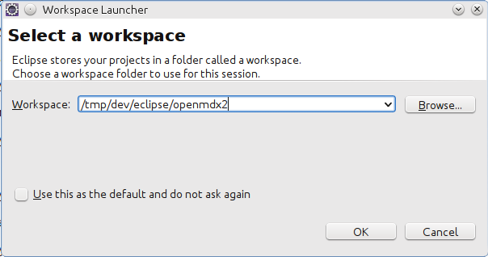

_Eclipse_ will be launched with a new empty workspace.

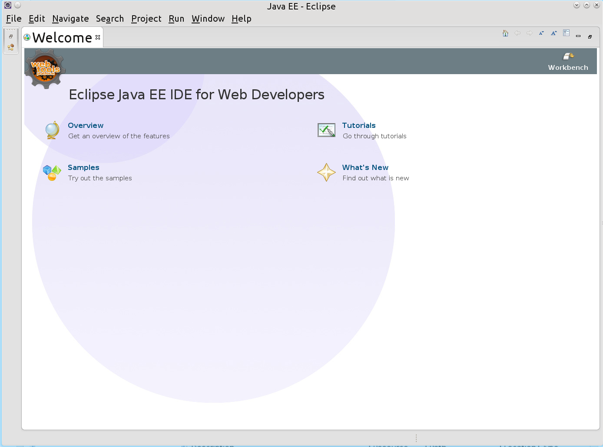

Close the Welcome page. 

Now we have to configure the JDK. Open the preferences dialog with _Window > Preferences_. Navigate to the entry _Java > Installed JREs_. Because _openMDX_ require a _JDK 1.8_ we first have to add a _JDK 1.8_ compliant _JRE_. Click on _Add_ and then enter _JRE 8_ as _JRE name_ and select the home directory of an installed _JDK 1.8_. _Eclipse_ automatically completes the other fields of the dialog as shown below:

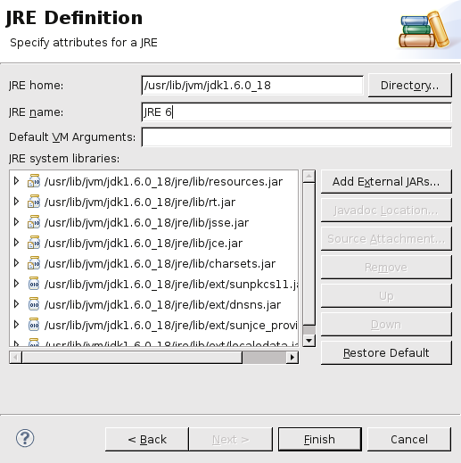

Select the newly added _JRE 8_ as default JDK and remove any other JDKs from the list.

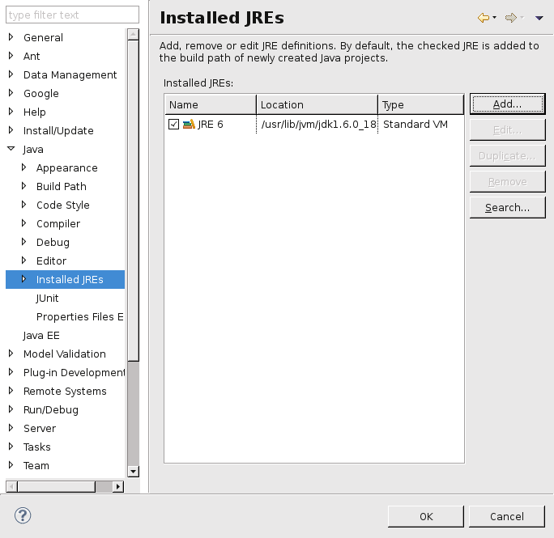

Next open the entry _Java > Compiler_ and set the compiler compliance level to 1.8.

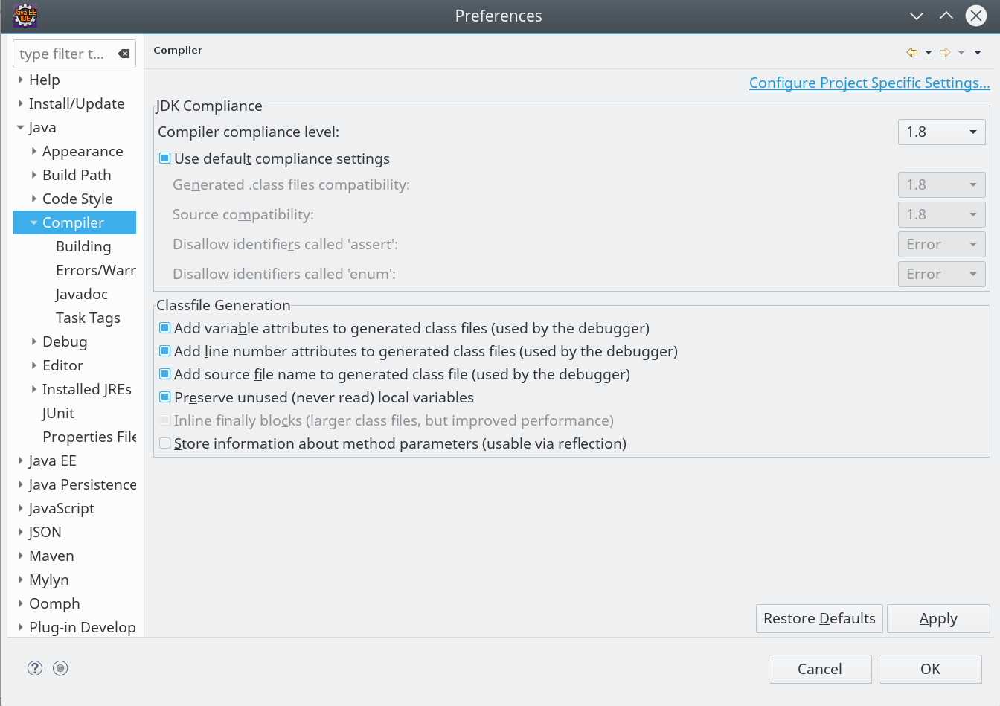

Next we will import the _openMDX SDK_ projects. Select _File > Import_.

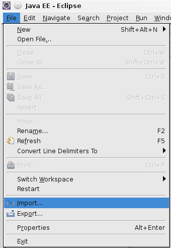

Select _Existing Projects into Workspace_.

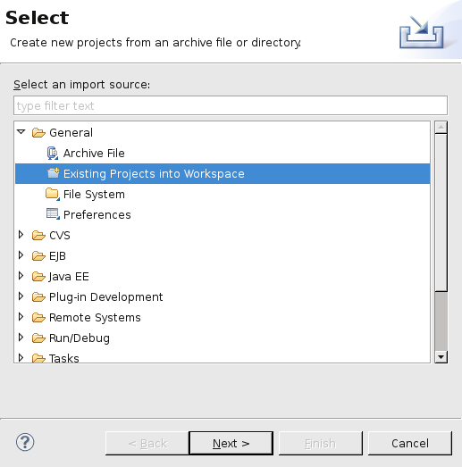

Navigate to the _openMDX SDK_ installation directory and then to the project folder _openmdx_. Eclipse recursively scans all directories. Deselect the projects _openMDX/Core_, _openMDX/Security_ and _openMDX/Portal_ because they occur multiple times as indicated below:

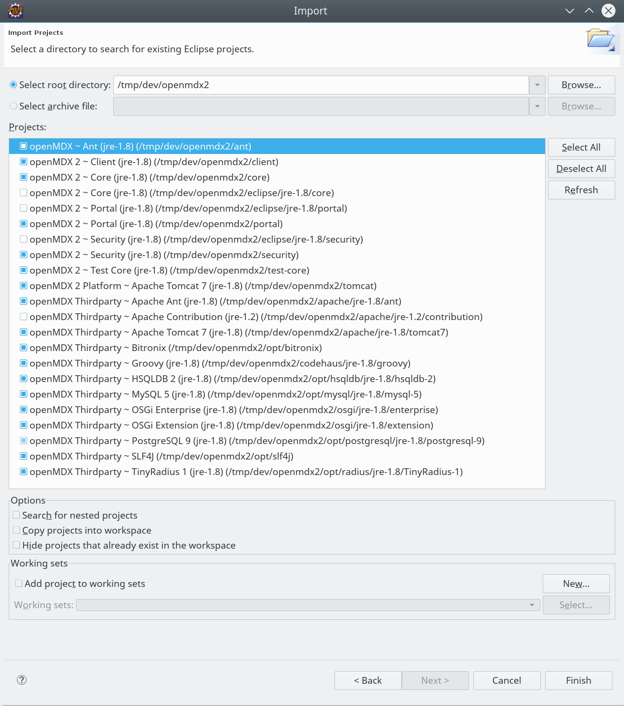

Your package explorer view now lists the projects shown below:

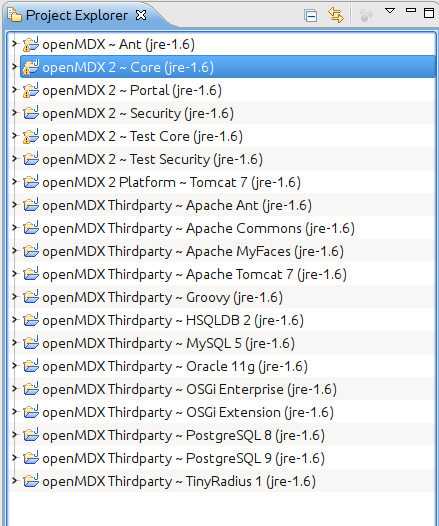

Finally, we add the modeling project files (_EMF_ and _Papyrus_) to the workspace. The projects contain the following UML class diagrams:

* _openMDX 2 ~ Core (EMF)_
* _openMDX 2 ~ Security (EMF)_  
* _openMDX 2 ~ Portal (EMF)_
* _openMDX 2 ~ Core (Papyrus)_
* _openMDX 2 ~ Security (Papyrus)_  
* _openMDX 2 ~ Portal (Papyrus)_
 
Import the EMF projects as shown in the screenshots below:

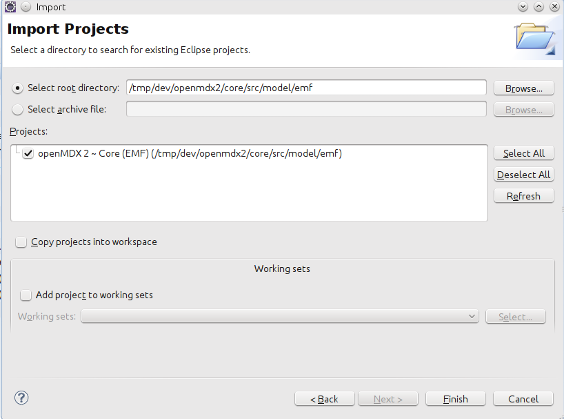

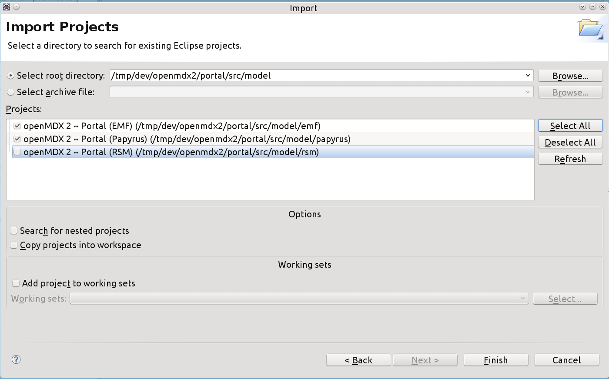

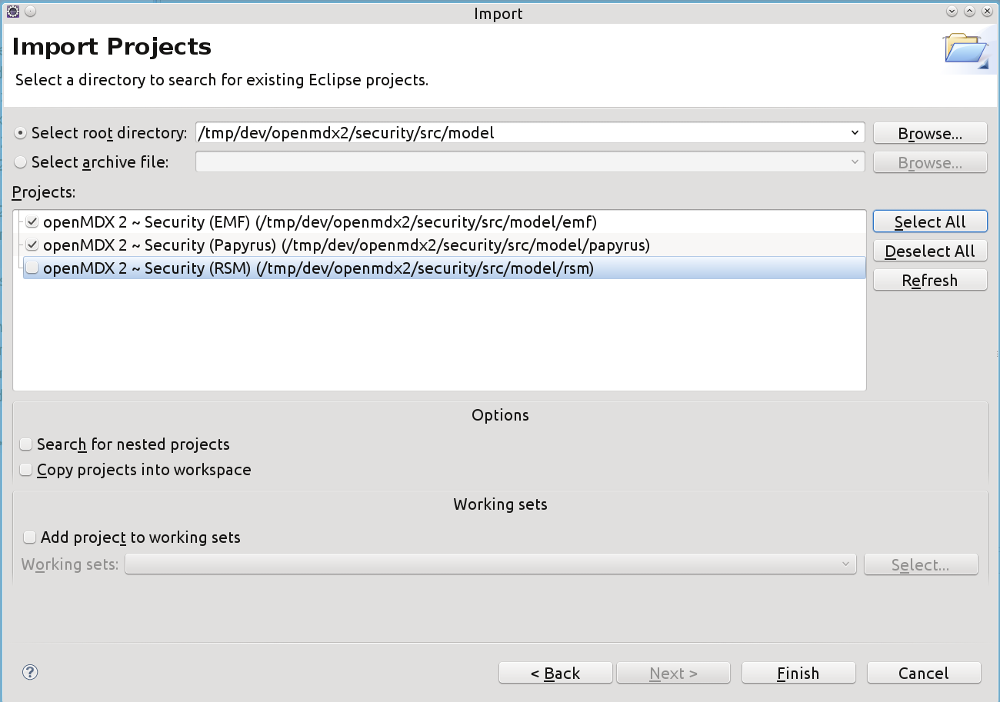

Repeat the same for the _Papyrus_ projects located in the _./src_model/papyrus_ folders.

## Congratulations ##
Congratulations! You have successfully prepared _openMDX SDK_ for _Eclipse_.