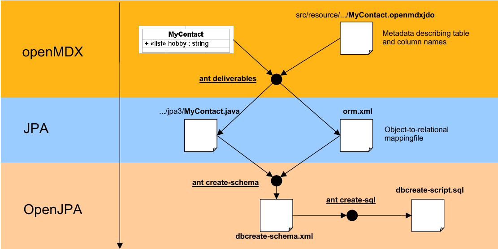
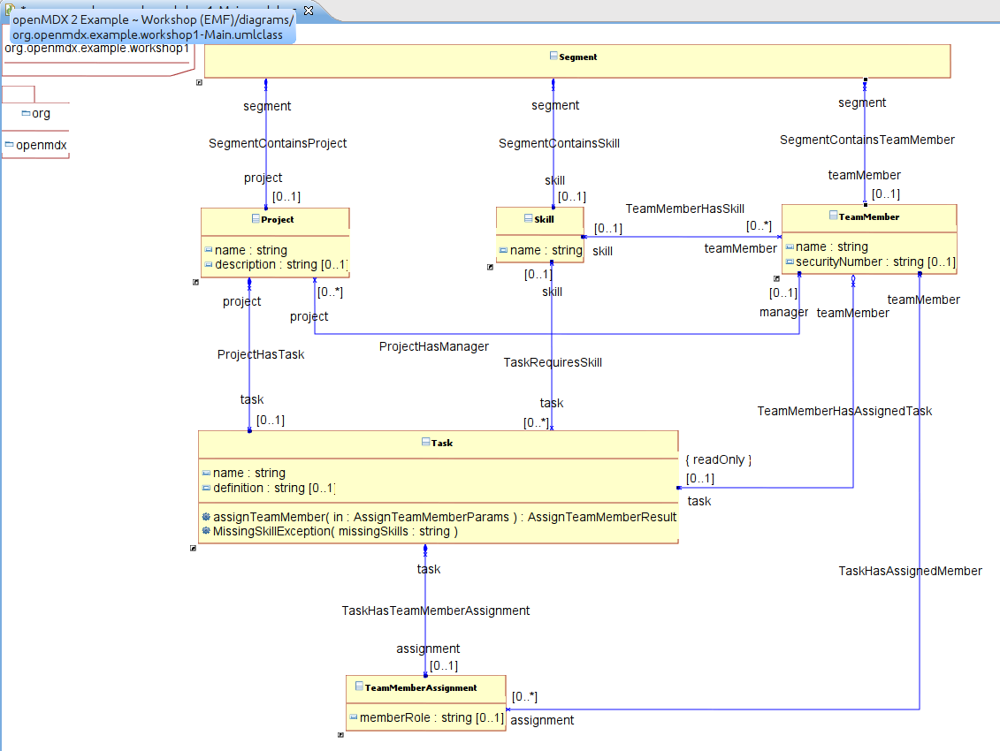

# openMDX Workshop Project #

This guide explains how to write applications using _openMDX_ based on the _openMDX/Examples Workshop_ project.

## Prerequisites ##

This guide assumes that

* The _openMDX SDK Examples_ are prepared as described in [openMDX SDK Examples](./Examples.md)
* You have read [Introduction to openMDX](./Introduction.md) and 
  [Introduction to Modeling with openMDX](./IntroductionToModeling.md) 

## Overview ##

_openMDX_ is an _MDA_-based framework so the model plays a central role in the development process of
_openMDX_-based applications. For more information about _MDA_ see [OMG Model Driven Architecture](http://www.omg.org/mda/).
This guide covers the following aspects which are important when developing _openMDX_ based applications:

* __Model__: Unlike with non-_MDA_ frameworks, the application's _API_ is specified with a _UML_ class model. 
  An _openMDX_-specific mapper maps the model to Java APIs and other artifacts, which are then used by the 
  programmer at development time and by _openMDX_ at runtime.
* __Business logic__: The business logic is implemented as Java classes, which implement the 
  generated APIs. Only the non-persistent features (or behavioral features) such as operations, 
  derived attributes, shared associations and validations must be implemented by the programmer. 
  Persistent features are handled by the _openMDX_ persistence manager.
* __Persistence__: The mapping generates _JPA_ classes which are used to create the application's database 
  schema. However, at runtime they are not used by _openMDX_. Instead, _openMDX_ comes with a generic, 
  model-driven persistence manager which is used to retrieve and store objects on the database. This 
  lightweight implementation allows _openMDX_ applications to be run on devices with limited memory and
  CPU resources.

## The Model ##
As already mentioned, the application's _API_ is specified as UML class diagram. The model plays a central
role in _openMDX_ based applications. It is used used during development and runtime.

### Development ###
The model specifies the _API_ of an application. It contains all business objects, their attributes and 
associations. _openMDX_ comes with a model mapping utility which automatically generates the following artifacts 
based on the model:

* __Java interfaces__: The model is mapped to Java interfaces according to the mapping specified
  by the _JMI_ standard (For more information see [The Java Metadata Interface (JMI) Specification](http://jcp.org/en/jsr/detail?id=40).
  After running _ant deliverables_ you will find these files in the _./build/jre-1.6/src/java_. The 
  model mapper generates _JavaBeans_ compliant interfaces with package-suffix _cci2_ and _JMI_-compliant 
  interfaces with package-suffix _jmi1_. These interfaces define the _API_ of the application. Object 
  instances can be managed at runtime using the _openMDX_ _JDO_-compliant persistence manager or the _REST_ 
  service. The class _org.openmdx.test.example.workshop1.TestExample\_1_ shows how to use the _Workshop_ _API_.
* __JPA classes__: Although the model specifies the _API_ of an application, it is a quite common use case that
  the same objects have to be made persistent and stored as-is in a database. Although an _openMDX_-based 
  application does not require objects to be persistent (objects may be fully transient), corresponding _JPA_ classes 
  with package-suffix _jpa3_ are generated by the model mapper for convenience. In addition the corresponding 
  _orm.xml_ is generated in _build/jre-1.6/src/resource/META-INF/_. As explained later in this guide, 
  the mapping process can be customized by supplying _JDO_ metadata information. For the _Workshop_ project these 
  files are located in _src/resource/org/openmdx/example/workshop1/jpa3/_.
* __Model XML files__: The mapper generates XML files for each model package. The model files contain the full 
  model information such as classes, attributes and associations. These files are used at runtime to populate 
  the _MOF_ repository (__Note__: technically the original XMI files could be used for this purpose. For 
  implementation reasons, _openMDX_ uses a normalized model file format).

All files generated by the mapper are stored in a _ZIP_ which is located in _build/jre-1.6/model/models.zip_. 
The build process extracts the files into the corresponding folders in the _build_ directory so that they are 
accessible by the _Java_ compiler and _Eclipse_.

### Runtime ###
A model repository gives access to the model information at runtime. The model repository is _MOF1_-compliant. 
It is used by the _openMDX_ runtime but can also be used by applications. The repository is populated
according to the model packages listed in the _/META-INF/openmdxmof.properties_ files found on the classpath.
The model is validated at load-time for consistency. _openMDX_ uses the model repository at runtime for the
following purposes:

* __Persistence manager__: Based on the model and additional database mapping information, the persistence 
  manager is able to store objects to and retrieve from any _SQL_-compliant database. The persistence manager 
  itself does not use the generated _JPA_ classes and also is not based on another persistence framework. The 
  persistence manager's data access layer is a generic, model-driven algorithm which dynamically generates the 
  required _SQL_ statements (for implementation details see _org.openmdx.application.dataprovider.layer.persistence.jdbc.Database\_1_).
* __Invoking business logic__: As already mentioned, the business logic is added as Java classes. The 
  corresponding implementation classes must be registered with the persistence manager. Every time a 
  feature (operation, attribute, association) is accessed on the _API_, the persistence manager checks whether 
  this feature is provided by an implementation class. If yes, the invocation is intercepted and dispatched 
  to the implementation class. If no, the access is delegated to the data access layer. This dispatching is 
  implemented in a generic way using the _Java_ proxy feature and requires access to the model information.
* __REST access__: The _REST_ servlet allows _REST_-based access to the application's _API_. This allows easy
  access to the _API_ for 3rd party applications. Moreover, _REST_ is also used as persistence manager internal
  protocol in case of distributed _openMDX_ applications. 
* __Generic GUI__: _openMDX_ comes with a _GUI_ which is a generic, model-driven _Java_ servlet. The model 
  information and additional, manual-written customizing meta data allows the servlet to dynamically render 
  a web-based _GUI_ which gives full access to all _API_ features. 

## Business Logic ##
The business logic is implemented as standard Java classes (and methods). Adding implementation classes 
requires the following steps:

* __Determine features to be implemented__: Inspect the model (or alternatively the generated Java _API_) 
  and determine features which you want to implement. Features which must be implemented are: operations, 
  derived attributes, derived references, shared associations. By default all other features are handled 
  by the persistence manager: a corresponding feature access is delegated 1:1 to the persistence layer 
  and handled by the database.  
* __Implement features__: Implement the features by creating a Java class which corresponds to the model
  class name and implements the feature as method. E.g. in the _Workshop_ project the class 
  _org::openmdx::example::workshop1::Task_ defines the operation _assignTeamMember_. This operation is 
  implemented by the _Java_ class _org.openmdx.example.workshop1.aop2.TaskImpl_ and operation _assignTeamMember_.  
  Shared associations can be either implemented in Java or at persistence-level by the means of database views. 
  The _Workshop_ project has one shared association: _TeamMemberHasTask_. This is implemented by the manual written
  view _OOMEP1WS\_JOIN\_TMEMBERHASTASK_ which is defined in _./src/sql/hsqldb-2/dbcreate\_views.sql_.
* __Register features__: The implemented business logic must be configured in the persistence manager's configuration 
  file _jdoconfig.xml_ which is located in _./src/ear/openmdx-workshop.ear/APP-INF/lib/openmdx-workshop.jar/META-INF_. 
  This is the main configuration file which in turn may reference additional configuration files. For the _Workshop_ 
  project these are:
* _WorkshopStandard.properties_: Configuration using database persistence
* _WorkshopVolatile.properties_: Configuration using in-memory persistence 

The Java classes are registered with the option _packageImpl_ in _jdoconfig.xml_. This option specifies the 
Java packages containing the implementation classes. The database view which implements the shared association 
_TeamMemberHasTask_ is configured in _WorkshopStandard.properties_. 

### Persistence ###
The _.openmdxjdo_ meta data files allow to customize the mapping of model classes to _JPA_ classes
and the _orm.xml_ which are generated by the _openMDX_ model mapper. An _.openmdxjdo_ file must be provided 
for each modeled type (a class referenced by composite association) and are optional for all other classes. The
_.openmdxjdo_ files allow to

* Map model classes to database tables
* Map attributes to column names
* Specify name of join tables in case of shared associations
* Specify non-persistent features

For the _Workshop_ project the files are located in _./src/resource/org/openmdx/example/workshop1/jpa3_. The
generated _JPA_ classes and _orm.xml_ are _JPA_-compliant and may be used by any _JPA_-compliant implementation.
_openMDX_ uses _OpenJPA_ during the build process for the purposes:

* ant task _create\_schema_: Given the _orm.xml_ and the _JPA_ classes a database-independent schema XML is generated
  using the _OpenJPA_ schema tool.
* ant task _create\_sql_: Given the schema _XML_ and the _JPA_ classes, a database-specific schema script is generated
  using the _OpenJPA_ scripting tool. This script can finally be used to setup the database.

As already mentioned, the _openMDX_ persistence manager provides its own database access. A 3rd party persistence
framework is not required at runtime.

The following figure gives an overview of this process.

## Development Roundtrip ##
This section a full development cycle, starting from the model up the the final deployable application.
This section is based on the _Workshop_ project.

### Project Structure ###
The standard project layout looks as follows:

~~~~~~
-build.xml
-build.properties
+etc
  +openjpa
    -enhance-persistence.xml
    -hsqldb-2-persistence.xml      # Connector used by create-schema, create-sql
+src
  +ear                             # EAR file layout for Workshop web application
  +java                            # Java sources
  +model                           # Model sources
  +resource                        # Resources such as jdoconfig.xml, .openmdxjdo mappings, ...
~~~~~~
  
### Create the Model ###
_openMDX_ requires that the class model is _MOF1_ compliant, i.e. use _MOF1_ model elements only. 
The restriction to _MOF_ model elements has the advantage that it is possible to apply standard 
_MOF_ mappings (e.g. _JMI_, _XMI_) to models and not just meta models. On the other side, 
the restriction to _MOF_ model elements does not have a big impact on the modeler. Features
such as association classes and class dependencies are typically not required for application-level 
modeling and if so, these features can be modeled in alternate ways. One exception are 
qualifiers: in addition to the _MOF_ model elements, _openMDX_ supports _UML qualifiers_. Qualifiers 
are required to specify in a precise way the object access paths. For more information about 
modeling see [Introduction to Modeling with openMDX](./IntroductionToModeling.md).

The figure below shows the _Workshop_ model. 

__NOTE:__ All modeled classes inherit from the class _org::openmdx::base::BasicObject_ 
(not shown). Extending from _BasicObject_ is not strictly required by the _openMDX_
persistence manager. However, it is good practice. _BasicObject_ defines the 
attributes _createdAt_, _createdBy_, _modifiedAt_, _modifiedBy_ which should be 
available for all business objects.

We recommend using _Eclipse UML2Tools_ in order to create the models. The following 
modeling tools are currently supported:
* EMF: _Eclipse UML2Tool_
* RSM: _IBM Rational Software Modeler_

Put the model files in the model tool specific sub-directory and instruct the model mapper 
which model files to use in _build.properties_:

~~~~~~
# Use EMF. Files are in ./src/model/emf
model.transformation.source=emf

# Use RSM. Files are in ./src/model/rsm
# model.transformation.source=rsm
~~~~~~

__NOTE__: Using _EMF_ properly requires some experience. In order to create a model for a
new project, it is a good idea to start with the model file from the _Workshop_ project. 
In a second step adapt the model package names and then add and remove classes and
associations to your needs.

As already explained, the model specifies the application's API. The model is mapped to
_Java_ interfaces. Clients use this API to access the application's business logic. This 
mapping implies that the API exposes a fine-granular object model. Unlike with typical 
web service APIs, a client does not invoke services by passing input parameters and 
receiving results. Instead, a client retrieves, queries, creates, updates and deletes 
objects using the persistence manager's _API_. It is important to note that not each
object and feature access necessarily leads to a service or database round-trip. The
_openMDX_ persistence manager implements a _REST_ pattern at transport-level and offers
many of the _JDO_ patterns which allow to minimize round-trips:

* Objects are cached client-side and have well-defined _JDO_-states
* Objects are retrieved with a default fetch set
* Optimistic or non-optimistic units of work (load, edit, store), etc.

This approach is a very different to the SOA approach as used by _WebServices_, 
_EJB_ or _CORBA_. _SOA_ requires to specify coarse-granular, service-oriented
interfaces, whereas the _openMDX_- (or _REST_-) based approach allows to specify 
fine-granular, business-object oriented interfaces.

### Add Business Logic ###
The _Workshop_ project comes with one implementation class _TaskImpl_. The class 
implements the operation _assignTeamMember_ which is defined on the model_ class
_Task_. The implementation package must be registered in the persistence manager's
configuration _jdoconfig.xml_ with the option _packageImpl_. Some facts are important
to notice:

* Implementation classes extend the abstract _AbstractObject_. This class has default 
  implementations for _JDO_ callbacks and offers some helper methods. _AbstractObject_ allows 
  the persistence manager to interact in a standard way with user-supplied implementations.
* It is not required that the implementation classes implement the mode-derived interfaces, 
  e.g. that _TaskImpl_ implements _org.openmdx.example.workshop1.jmi1.Task_. This way, only the 
  methods with custom-specific business logic have to be implemented. Non-implemented features 
  are not dispatched and handled by the persistence manager. The default behaviour is to 
  forward the request to the next plug-in in the configured plug-in stack which is typically 
  the data access layer (the plug-in stack is configured in _jdoconfig.xml_).

### Add Persistence ###
Most of the persistence work is handled by the model-driven _openMDX_ persistence manager.
However, a few steps involves manual work:

* Create a database
* Create the database schema
* Configure the persistence manager

The following databases are supported by the _openMDX_ persistence manager:

* PostgreSQL
* HSQLDB
* MySQL
* Microsoft SQL Server
* Oracle
* DB/2

#### Create the database ####
In the _Workshop_ example we use _HSQLDB_. There are scripts to start the database and
launch the database manager. The scripts are located in the folder _etc/data/workshop/_.
_./startdb.sh_ starts the database, _./startdbmanager.sh_ starts the database manager console. 
The _Workshop_ example comes with an initialized database containing sample data. If you
want to start with an empty database, clear the content of the file _etc/data/workshop/workshop.script_
and restart _HSQLDB_.

#### Create the database schema ####
The _openMDX_ build libraries provide ant tasks which allow to create the database schema for
a project. As described in the previous sections, the process to build a schema is as follows:

* Running _ant deliverables_ generates a _JPA_-compliant _orm.xml_ which is stored in 
  _build/jre-1.6/src/resource/META-INF/orm.xml_.
* Running _ant -Ddatabase.name="hsqldb-2" create-schema"_ creates a database-independent schema 
  file which is stored _build/jre-1.6/src/sql/openjpa-schema.xml_. 
* Move the file _openjpa-schema.xml_ to the folder _src/sql/_. Open it in _Eclipse_. Remove all 
  table definitions which are not prefixed with _OOMEP1WS_. Also remove the table definition 
  _OOMEP1WS\_JOIN\_TMEMBERHASTASK_. This object will be implemented by a manual-written view. 
* Running _ant -Ddatabase.name="hsqldb-2" create-sql_ generates the schema scripts for _HSQLDB_. 
  The output goes to _build/jre-1.6/src/sql/_.
* Execute the script _hsqldb-2-build.sql_ in the _HSQLDB_ database manager console. This creates 
  the schema for the _Workshop_ database.

### Building the Project ###
You are now ready to build and run the project. 

~~~~~~
ant clean
ant deliverables
~~~~~~

The _Workshop_ project has two run units:

* A _Junit_ test running _TestExample\_1_ in console mode. The _Junit_ prepares the _JNDI_ by adding 
  _JDBC_ connector entry for the _Workshop_ database. This allows to launch and run the _openMDX_ persistence
  manager on a standard _JVM_ without using the services of an application server. You can run the _Junit_ on
  the console with the command _ant test_. 
* Running _ant assemble_ creates a _Workshop_ web application which can be deployed on _TomEE_. 
  See [openMDX SDK Examples](./Examples.md) for setting up the environment. 

## Congratulations ##
Congratulations! You have successfully completed the _openMDX Workshop Project_ guide.
